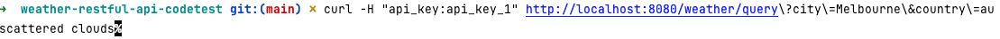
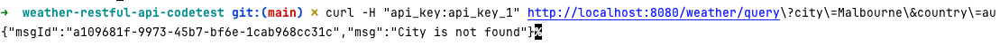
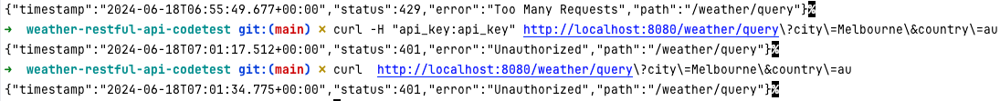
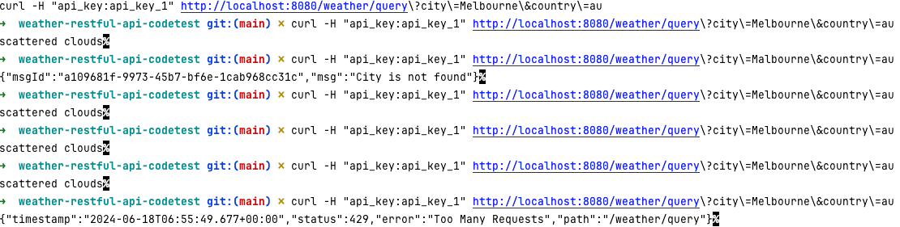
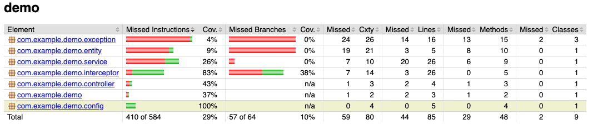

# Weather-Restful-API-CodeTest

## Run this application

* Download the code and then go to project folder
* Run the command to build&start the project: **mvn spring-boot:run**

## Test the application

* **Positive Case**
  ~~~bash
  curl -H "api_key:api_key_1" http://localhost:8080/weather/query\?city\=Melbourne\&country\=au
  ~~~

 * **Not Found Case** 
  ~~~bash
  curl -H "api_key:api_key_1" http://localhost:8080/weather/query\?city\=Malbourne\&country\=au
  ~~~

* **Invalid Token Case**
  ~~~bash
  curl -H "api_key:api_key_1" http://localhost:8080/weather/query\?city\=Malbourne\&country\=au
  ~~~

* **Rate Limit Case**

# Jacoco Report

# Tech Stack

* **Springboot 3** quick development
* **Docker** build as docker image for deployment
* **Trivy** for vulnerability scanning
* **Github Action** for CI/CD

## Next Step

* Improve the UnitTests
* Remove the hardcoded token, passing it from vault or secrets manager
* SAST tool
* ....

